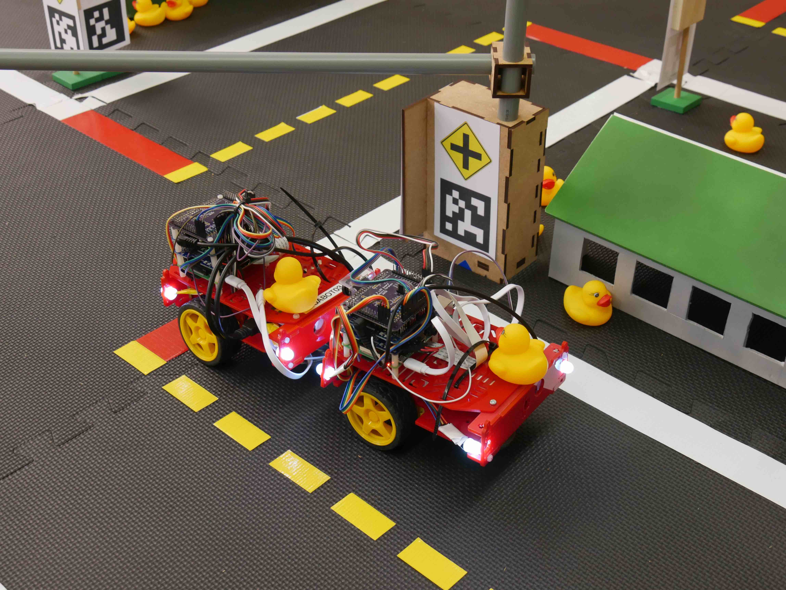
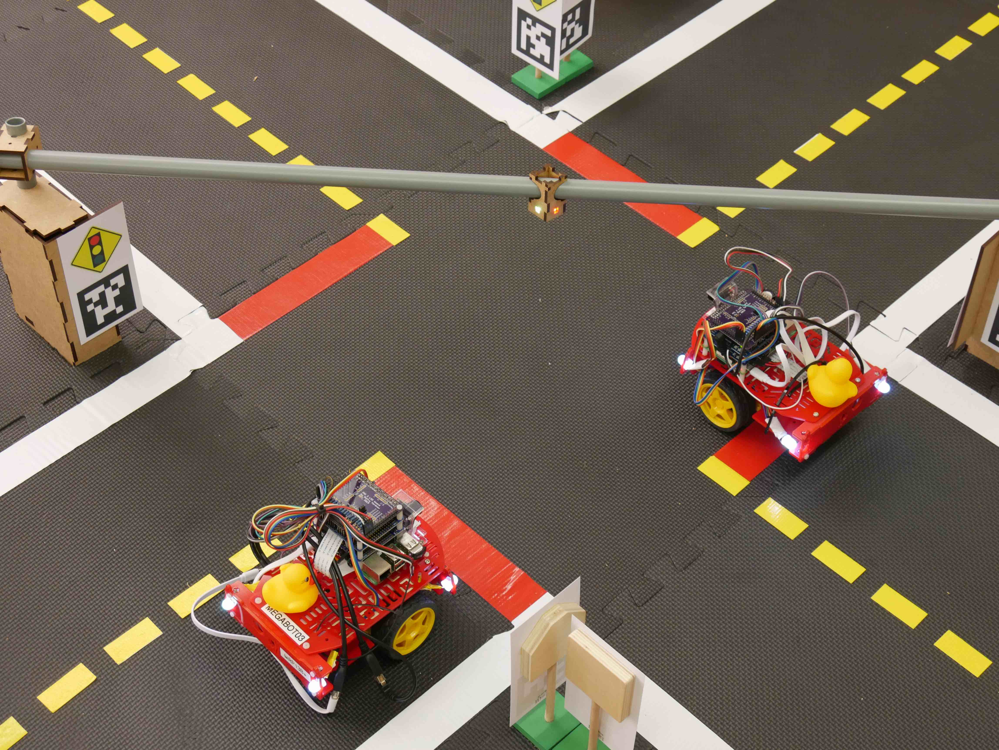

# Task: Lane following + Dynamic vehicles (LFV) {#lf_v status=draft}

The second task of the *AI Driving Olympics* is "Lane following with dynamic vehicles".
This task is an extension of Task LF to include additional rules of the road and other moving vehicles.

Again we ask participants to submit code allowing the Duckiebot to drive on the right-hand side of the street within Duckietown. Due to interactions with other Duckiebots, the task is designed no longer completely \emph{reactive}. Especially at intersections, the STOP-sign will have to be observed, which requires keeping track of at least some past information.

TODO: Ego perspective pictures with other vehicles in sight and for collision and intersection - yield position

The robot used in this task is a Duckiebot as described in . The environment of the task is Duckietown as described in . Different to task 1, the environment now includes intersections, STOP-signs and other moving vehicles.
