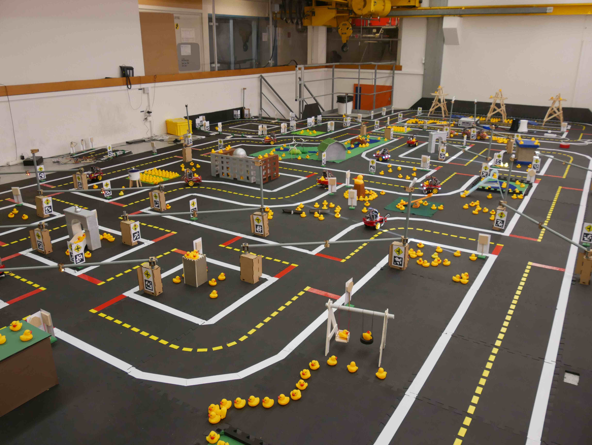

# Task: Navigation + Dynamic vehicles (NAV) {#nav_v status=draft}

The third task of the *AI Driving Olympics* is "Navigation with dynamic vehicles".
This task is an extension of task LF and task LFV and now focuses on navigating from location "A" to location "B" within Duckietown. The task also includes a map of Duckietown as input.

Again we ask participants to submit code allowing the Duckiebot to navigate from location to location by driving on the right-hand side of the street within Duckietown. Given interactions with other Duckiebots, the same rules of the road as in the Task 2 have to be respected.

### Performance objective

As performance objective on the task, we denote the expected time to go from point A to point B. To reliably evaluate the metric, multiple pairs of points A, B will be sampled.

The robot used in this task is a Duckiebot as described in . The environment of the task is Duckietown as described in . Different to task 1 and 2, the input to the Duckiebot now also includes a map of Duckietown.
