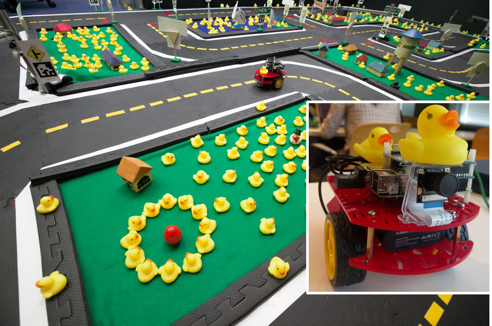
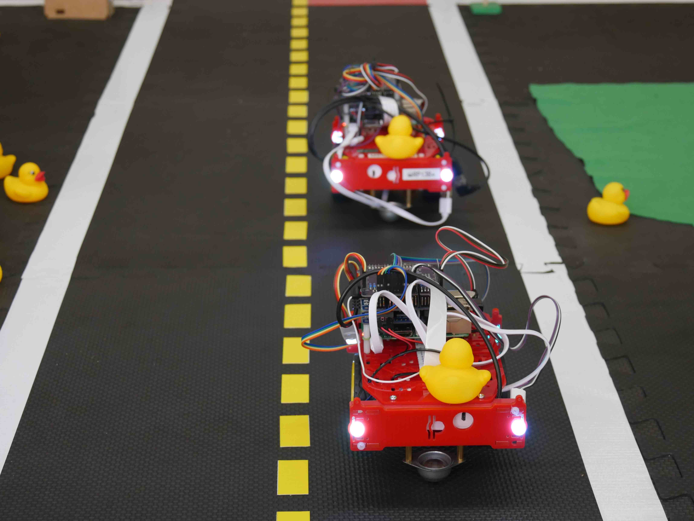

# Overview of the competition {#aido-overview status=beta}

What are the *AI Driving Olympics*? The AI Driving Olympics (AIDO) are a set of robotics challenges designed to exemplify the unique characteristics of data science in the context of autonomous driving.

To understand how to solve a robotics challenge, we will explore the various dimensions of performance and difficulties involved.

## Novelty

Many competitions exist in the robotics field.

One example is the long-running annual Robocup, originally thought for robot soccer (wheeled, quadruped, and biped), and later extended to other tasks (search and rescue, home assistance, etc.). Other impactful competitions are the DARPA Challenges, such as the DARPA Grand Challenges in 2007-8 that rekindled the field of self-driving cars, and the recent DARPA Robotics Challenge for humanoid robots.

In the field of robotics, these competitions are generally considered to be extremely useful to push the state of the art, and to make the field more reproducible by imposing exact and uniform experimentation environments.

In ML in general, and at NIPS in particular, there exist no competitions that involve physical robots. Yet, the interactive, embodied setting is thought to be an essential scenario to study intelligence. The only kind of intelligence we know, animal intelligence, evolved exactly for organisms to move in an environment and to interact with it.

The application to robotics is often stated as a motivation in recent ML literature (e.g., \cite{Singh,DARLA} among many others). However, the vast majority of these works only report on results \emph{in simulation} and on \emph{very simple} (usually grid-like) environments.

The importance of standardized benchmarks in ML research is well understood. Therefore, it is only a matter of time before a robotic benchmark will be developed. This is our attempt at suggesting such a benchmark.

The following elements are necessary and unique (with respect to other ML "offline" benchmarks) attributes of a robotics benchmark:

* closed-loop, realtime interactive tasks;
* complex tasks and environments;
* competitive solutions require complex architectures;
* very concrete resource constraints (computation, bandwidth, etc.);
* multidimensional metrics (safety, performance, compliance, etc.).

We believe that these unique elements within robotics make it a unique and timely application of ML that requires further study.

## Background and impact

This event will probe the frontier of the state of the art in ML: the interactive and embodied setting. Deep learning has been an astounding success for pattern recognition / supervised learning, and synthetic domains (Go, Atari, ...). It is an open question whether the same success can be repeated for embodied interactive tasks that happen in the messy real world. Despite many enthusiastic research efforts , the state of the art is way behind what is required in a safety-critical application like self-driving cars.

Can "black box", symbol-less AI power safety-critical systems like self-driving cars?

We propose to test this hypothesis using the miniature
self-driving cars of "Duckietown", a platform for autonomy education and research ().

To learn more about Duckietown, the reader might start [by watching a few videos](http://vimeo.com/duckietown).

At present, the Duckietown platform comprises mostly "classical" (non-neural) baseline implementations of typical robotics navigation tasks, with learning used only in a few instances (such as object detection). The promise of DL is that these methods should be able to easily eclipse classical methods---but is this really the case?

<figcaption>
In Duckietown, inhabitants (duckies) are transported via an autonomous mobility-on-demand service (Duckiebots). Duckietown is designed to be inexpensive and modular, yet still enable many of the research and educational opportunities of a full-scale self-driving car platform.
The robots are completely vision based and all computation runs in real time on a Raspberry PI.
</figcaption>

Many recent works in deep (reinforcement) learning cite robotics as a potential application domain \cite{darpa_grand_challenge}. However, comparatively few actually demonstrate results on  physical agents. This competition is an opportunity to properly benchmark the current state of the art of these methods as applied to a real robotics system.

Our experience thus far indicates that many of the inherent assumptions made in the ML community may not be valid on real-time physically embodied systems. Additionally, considerations related to resource consumption, latency, and system engineering are rarely considered in the ML domain but are crucially important for fielding real robots.

Ultimately, the hope is that we can use this competition to benchmark the state of the art as it pertains to real physical systems and, in the process, hopefully spawn a more meaningful discussion about what is necessary to move the field forward.

The best possible  outcome is that a larger proportion of the ML community redirects its efforts towards real physical agents acting in the real world, and helps to address the unique characteristics of the problem. The guaranteed impact is that we can establish a baseline for where the state of the art really is in this domain.

## Overview of tasks {#task_overview}

 
 
 
 <!--  -->
 

<!-- LF  |  LFV  |  NAVV  |  FM       |  AMoD
:-------------------------:|:-------------------------:|:-------------------------:|:-------------------------:|:-------------------------:
  |   |   |   |   -->

The AI Driving Olympics competition is structured into the following four separate tasks:

###[Embodied individual robot tasks](#embodied_tasks)

Tasks within which code to control a single Duckiebot is submitted.

  * [Lane following (LF)](#lf): Control of a Duckiebot to drive on the right lane on streets within Duckietown without other moving Duckiebots present.

  * [Lane following + vehicles (LFV)](#lf_v): Control of a Duckiebot to drive on the right lane on streets within Duckietown with other moving Duckiebots and static obstacles present.

  * [Navigation + vehicles (NAVV)](#nav_v): Navigation task of a Duckiebot to drive from point $A$ to point $B$ within Duckietown while following the rules of the road and while other Duckiebots are likewise driving in the road.

###[Fleet-level social task](#social_tasks)

Tasks within which code to control multiple robots or agents is submitted while lower-level functions are already provided.

  <!-- * [Fleet management (FM)](#fm): Task to control a small fleet of Duckiebots within Duckietown to pick up a set of virtual customers and drive them to a destination point. -->

  * [Autonomous Mobility-on-Demand (AMoD)](#amod): Task to control the movement of a fleet of autonomous vehicles in a simulated city to pick up customers and drive them to their destinations.

Participants may submit code to each challenge individually. Tasks proposed in the *AI Driving Olympics* are ordered first by type and secondly by increasing difficulty in a way which encourages modular reuse of solutions to previous tasks.

## Submission

<!-- There are two ways of participating in the AI Driving Olympics. -->

<!-- ### End-to-end type -->

You are evaluated on the [objectives](#part:aido-rules) defined for the task you are submitting to.

<!-- Either you can provide an end-to-end solution; or you can choose from a zoo of architectures, with interchangeable modules. You can write your own modules, or you can use those made available. -->

### Learning protocol

There are different ways to learn on Duckietown data and simulator interactions. We use this process:

* **Off-policy learning:** you are given sensorimotor logs taken in the robotariums, without any other annotation.
* **Active learning in a simulator:** your learner is paired with a simulator that gives as feedback vectors of violation metrics.

### Evaluation

There is a two-fold evaluation for submitted code.

* **Evaluation in simulation:** The learned agent is tested in simulation to make sure that it is safe.
* **Evaluation in robotarium:** The learned agent is evaluated in robotariums to provide the final scores.

After the evaluation in robotarium, the sensorimotor logs as well as violation metric annotations are made available to everybody to be used in off-policy learning.

In addition, the developer also gets the logs of intermediate signals produced by their agent (assuming these logs are reasonably small).

<!-- ### Modules type

Another mode of submission is that people can also compete in simpler tasks by creating modules for some well-defined tasks such as:

* Lane localization: given image localize the robot in the lane
* Vehicle detection: given image localize the other robot

We compute metrics (e.g. memory usage, latency, etc.) but you are not scored on metrics. Other participants in the end-to-end type may use your module. You win if somebody else uses your module in the end-to-end type.

**Learning protocol for module entries**

This metric is formalized uses supervised learning from logged data and unsupervised learning from logged data.

* **Supervised learning from logged data:** You are given as input the input data, and the output data, produced either using a baseline solution, or by a ground truth system.
* **Unsupervised learning from logged data:** You have access to other unlabeled logs. -->

<!-- **Evaluation:**

We compute a set of metrics (using e.g. ground truth data) but these are not used for winning.
The module wins if it is used in an end-to-end entry that wins.  -->

<!-- For a mathematical introduction to solving tasks in the context in robotics, please refer to . -->

<!-- <cite id="bib:Singh">TODO: find paper Singh</cite> -->

<!-- <cite id="bib:darpa_grand_challenge">TODO: find paper DARLA</cite> -->

<!-- <cite id="bib:cmu_self_driving_original">TODO: find paper autonomous_cmu</cite> -->

<!-- <cite id="bib:autonomous_germany">TODO: find paper autonomous_germany</cite> -->

<!-- <cite id="bib:robotarium">TODO: find paper Robotarium</cite> -->

<!-- <cite id="bib:AprilTags">TODO: find paper AprilTags</cite> -->

<!-- <cite id="bib:amodeus">TODO: find paper amodeus</cite> -->

<!-- <cite id="bib:DARLA">TODO: find paper DARLA</cite> -->

<!-- <cite id="bib:overview_autonomous_vision">TODO: find paper overview_autonomous_vision</cite> -->

<!-- <cite id="bib:japan_self_driving">TODO: find paper japan_self_driving</cite> -->

<!-- <cite id="bib:autonomous_nvidia">TODO: find paper autonomous_nvidia</cite> -->

<!-- <cite id="bib:paull2017duckietown">TODO: find paper paull2017duckietown</cite> -->

<!-- <cite id="bib:schwarting2018planning">TODO: find paper schwarting2018planning</cite> -->

<!-- <cite id="bib:Pfeiffer2017FromRobots">TODO: find paper Pfeiffer2017FromRobots</cite> -->
