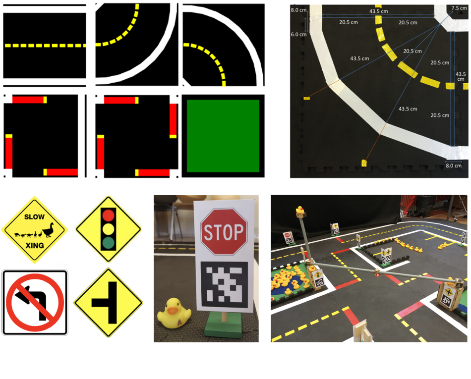
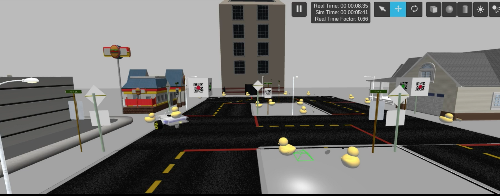
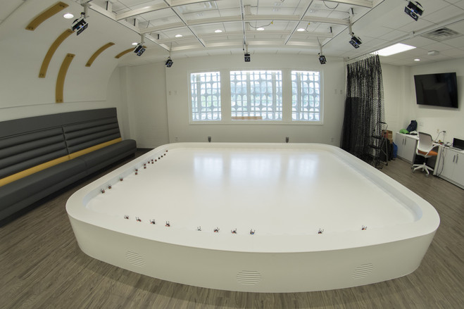

# Embodied individual robot tasks {#embodied_tasks status=beta}

$$
\newcommand{\AC}[1]{{\color{blue}AC: #1}}
\newcommand{\JZ}[1]{{\color{olive}JZ: #1}}
\newcommand{\fix}{\marginpar{FIX}}
\newcommand{\new}{\marginpar{NEW}}
% Robot:
\newcommand{\dynamical}{\mathcal{D}}
\newcommand{\robot}{\mathcal{R}} % Robot
\newcommand{\config}{\mathcal{Q}} % Configuration space (of robot)
\newcommand{\sensors}{\{z\}} % Sensor set
\newcommand{\bandwidth}{\mathcal{B}}
\newcommand{\computation}{\mathcal{C}}
\newcommand{\memory}{\mathcal{M}}
\newcommand{\actuators}{\mathcal{A}}
\newcommand{\knowledge}{\mathcal{K}}
\newcommand{\perception}{P}
\newcommand{\control}{U}
\newcommand{\actions}{\mathcal{U}}
% Robot mathematics
\newcommand{\operator}{T}
% Groups:
\newcommand{\groups}{G}
%\newcommand{\group}{g}
\newcommand{\groupalgebra}{\mathfrak{g}}
% Scene space
\newcommand{\timespace}{\mathbb{T}}
\newcommand{\environment}{E}
\newcommand{\scene}{\xi}
\newcommand{\scenespace}{\Xi}
\newcommand{\universe}{U}
% Sensor space
\newcommand{\sensor}{\zeta}
\newcommand{\sensorproj}{z}
\newcommand{\sensorspace}{Z}
\newcommand{\projection}{\pi}
\newcommand{\projectionspace}{\Pi}
\newcommand{\viewport}{v}
\newcommand{\viewportspace}{\mathcal{V}}
% Data space
\newcommand{\dataspace}{\mathcal{X}}
\newcommand{\data}{x}
\newcommand{\dataproj}{\phi}
\newcommand{\datakernel}{\psi}
% Output space
\newcommand{\outputy}{y}
\newcommand{\outputspace}{\mathcal{Y}}
% Task space
\newcommand{\task}{T}
\newcommand{\taskspace}{\mathcal{T}}
\newcommand{\objective}{\mathcal{J}}
\newcommand{\robotictask}{RT}
\newcommand{\rules}{\Phi}
\newcommand{\constraints}{\Lambda}
% Action space
\newcommand{\action}{u}
\newcommand{\actionspace}{\mathcal{U}}
\newcommand{\nuisance}{\nu}
% Other characteristics / symbols
\newcommand{\place}{\eta}
\newcommand{\image}{I}
\newcommand{\noise}{n}
\newcommand{\pose}{p}
\newcommand{\shape}{S}
\newcommand{\albedo}{\rho}
% Information theory
\newcommand{\information}{\mathcal{I}}
\newcommand{\expectation}{\mathbb{E}}
% Optimization
\newcommand{\loss}{L}
$$

This section focuses on the infrastructure and background of the embodied individual robotic tasks as outlined in .

For examples of Duckiebot driving see [a set of demo videos of Duckiebots driving in Duckietown](#demos).

The actual embodied tasks will be described in more detail in , , . Note that the sequence tasks was chosen to gradually increase the difficulty of tasks by extending previous task solutions to more general situations.

## Platform

There are three main parts in our system with which the participants will interact:

1. The **physical Duckietown platform** (): miniature vision-based vehicles and cities in which the vehicles drive. This is an inexpensive setup (\$100/robot). The robot hardware and environment are rigorously specified, which makes the development extremely repeatable (For an example of this see .
2. A **cloud simulation** and training environment, which allows to test in simulation before trying on the real robots.
3. **Remote "robotariums"** in which to try the code in controlled and reproducible conditions.

### Device$\rightarrow$cloud$\rightarrow$device deployment pipeline

We expect most participants to choose to build their own Duckietown and Duckiebots. All of the equipment needed to do so is available at a reasonable cost, and all of the instructions are provided on the project website.

The cloud simulation is provided as an alternative for development.

The cloud simulation also serves as a selection mechanism to access the remote robotarium.

The robotariums are needed to enable reproducible testing in controlled conditions. The robotarium scores are valid scores for the leader board and they are used for the final selection of which code will be run at the live competition at NIPS.

For winning the competitions, the only valid scores
are the scores obtained at the live competition. The participants will not need to be physically at NIPS --- they can participate remotely by submitting a Docker container, which will be run for them following standardized procedures.

### The physical Duckietown platform

We briefly describe the physical Duckietown platform, which comprises  autonomous vehicles (*Duckiebots*) and a customizable model urban environment (*Duckietown*).

#### Robot {#robot}

Duckiebots are designed with the objectives of affordability, modularity and ease of construction. They are equipped with only one *sensor*: a front viewing camera with $160$ deg fish-eye lens capable of streaming $640\times480$ resolution images reliably at $30$ fps.

*Actuation* is provided through two DC motors that independently drive the front wheels (differential drive configuration), while the rear end of the Duckiebot is equipped with a passive omnidirectional wheel.

All the *computation* is done onboard on a Raspberry Pi 3 computer, equipped with a quad Core 1.2 GHz, 64 bit CPU and 1 GB of RAM.

We will support other configurations for the purposes of deploying neural networks onto the robots.
More details in .

*Power* is provided by a $10000$ mAh battery which provides several hours ($>5$) of operation.

#### Environment {#environment}

Duckietowns are modular, structured environments built on two layers: the *road* and the *signal* layers ().

There are six well defined *road segments*: straight, left and right $90$ deg turns, 3-way intersection, 4-way intersection, and empty tile. Each is built on individual tiles, and their interlocking enables customizability of city sizes and topographies. The appearance specifications detail the color and size of the lines as well as the geometry of the roads.

The signal layer comprises of street signs and traffic lights. *Street signs* enable global localization (knowing where they are within a predefined map)  of Duckiebots in the city and interpretation of intersection topologies. They are defined as the union of an AprilTag \cite{AprilTags} in addition to the typical road sign symbol. Their size, height and relative positioning with respect to the road are specified. Many signs are supported, including intersection type (3- or 4-way), stop signs, road names, and pedestrian crossings.

*Traffic lights*  provide a centralized solution for intersection coordination, encoding signals in different LED blinking frequencies. They are equipped with an overhead camera, with field of view of one tile in every direction from the intersection.

<figcaption>The Duckietown environment is rigorously defined at road and signal level. When the appearance specifications are met, Duckiebots are guaranteed to navigate cities of any topology.</figcaption>

#### Cloud simulation

Additionally, we will provide a cloud simulation environment for training.

In a way similar to the last DARPA Robotics Challenge, we will use the simulation
as a first screening of the participants. It will be necessary for the code to run in simulation
to gain access to the robotariums.

Simulation environments for each of the individual challenges will be provided as Docker containers with clearly specified APIs. The baseline solutions for each challenge will be provided as separate containers. When both containers (the simulation and corresponding solution) are loaded and configured correctly, the simulation will effectively replace the real robot(s). A proposed solution can be uploaded to our cloud servers, at which point it will be automatically run against our pristine version of the simulation environment (on a cluster) and a score will be assigned and returned to the uploader.

Examples of the simulators provided are shown in .
The left panel shows a lightweight simulator with low-level timing control built on OpenGL. This simulator is also integrated with the OpenAI Gym environment for reinforcement learning agent training. An API for designing reward functions or tweaking domain randomization will be provided. The simulator in the right panel is built on Gazebo and has much more high fidelity physics models for high-level control algorithm testing and tuning and will be used to test algorithms for the navigation tasks.

<figcaption>
We have developed various ways of simulating the Duckiebots sensors,
navigating the tradeoff of simulation speed vs output accuracy.
</figcaption>

For the mobility-on-demand task, in which the AI must respond to ride requests and allocate existing cars to each task, we will develop a standard neural-networks-friendly representations (for example, a pixel-based description of the map and the vehicles location.)

#### Robotariums

<figcaption>The Robotarium currently operating at Georgia Tech. It contains 30 robots. It uses an external motion capture system. About 300 users use the Robotarium
to conduct remote experiments. Two similar installations are under construction outside of Georgia Tech. }
</figcaption>

In the months before the competition, we will make available five robotariums for remote testing of the code in a controlled environment.

The idea of a robotarium (contraction of *robot* and *aquarium*) was conceived at Georgia Tech \cite{robotarium}. Currently the Georgia Tech robotarium has about 300 users. The users are able to submit programs that guide the movements of a swarm of robots. The system queues the requests, runs the programs, then sends the results, before resetting the robots to the initial state for the next user. Because there is no human intervention required, and the robot self-charge, the robotarium can run continuously.

The use of a robotarium has two advantages:

1. Convenience: It allows convenient access to a complete robot setup.
2. Reproducibility: It allows for multiple people to run the experiments in repeatable controlled conditions.

The Duckietown robotariums will be built in five institutions:

1. At ETH Zürich. The projected size is sufficient to allocate 20 robots continuously running (20 robots on the road + 20 robots in charging stations).
2.  At National Chiao Tung University, Taiwan. The size will be similar to the ETH Zürich installation.
3. At Tsinghua University, People's Republic of China.  The size will be similar to the ETH Zürich installation.
4. At the University of Montréal. The size is to be determined; it will likely be smaller than Zürich and Taiwan.
5. At Georgia Tech. Size to be determined.

These robotariums will remain available after the competition ends, for follow-up editions,
as well as for regular research activities.

#### Computational substrate available {#computation}

The Duckietown platform uses the ROS middleware, so it is easy to run the computation off-board. For example, during the development, students usually edit code and run it directly on their laptops.

For the competition we will the "purist" computational substrate option: the only computation available is the Raspberry PI 3 processor on board. The baseline solutions we provide using conventional methods run in real time using the Raspberry PI processor only.

## Performance metrics {#performance_metrics}

Measuring performance in robotics is less clear cut and more multidimensional than traditionally encountered in machine learning settings. To nevertheless achieve reliable performance estimates, we define $N$ to be the number of experiments. Let $\objective$ denote our objective or cost function to optimize which we report for every experiment.

In the following we will summarize the objectives used to quantify how well an embodied task is completed. We will evaluate performance in three different categories: *performance objective*, *traffic law objective* and *comfort objective*. Please note that the three provided objectives are not merged into one number.

### Performance objective {#performance_indicators}

As a performance indicator for the *lane following task* and the *lane following task with other dynamic vehicles*, we choose the average speed $v_t$ over time of the Duckiebot as measured across the moved distance (lap time). This both encourages faster driving as well as algorithms with lower latency. The factors $\kappa$ and $\rho$ are multiplied to be able to weigh the performance indicators relative to other metrics.

$$
\objective_{PS} = \expectation_t[-\kappa v_t]
$$

Similarly, for the *navigation with dynamic vehicles task*, we choose the average speed to go from point $A$ to point $B$ within Duckietown as performance indicator.

$$
\objective_{SAB}(t) = \expectation_{A,B}[T_{A \to B}]
$$

### Traffic law objective {#traffic_laws}

The following are a list of rule objectives the Duckiebots are supposed to abide by within Duckietown. All individual rule violations will be summarized in one overall traffic law objective $\objective_{TL}$.

#### Quantification of "Staying in the lane"

 The Duckietown traffic laws say:

 *The vehicle should stay at all times in the right lane, and ideally near the center.*

 We quantify this as follows: Suppose that $d$ is the absolute perpendicular distance of the body from the midline of the lane, such that $d=0$ corresponds to the robot at the center. While $d$ stays within an acceptable range no cost is incurred. When the small safety margin $d_{safety}$ is violated cost starts accruing proportional to the squared distance $d$ up to an upper bound $d_{max}$. If even this bound is violated a lump penalty $\alpha$ is incurred.

 So we define the "stay-in-lane" cost function as follows:

 $$
 \Delta \objective_{LF} = \begin{cases} 0  & \text{if } d < d_{safety} \\
     \beta d^2 & \text{if } d_{safety} \leq d \leq d_{max} \\
   	\alpha & \text{if } d > d_{max} \text{ or if $d$ is not within field-of-view anymore}
   	\end{cases}
$$

 #### Quantification of "Stopping at red intersection line"

 The Duckietown traffic laws say:

 *Every time the vehicle arrives at an intersection with a red stop line,
 the vehicle should come to a complete stop, before continuing.*

 During each intersection traversal, the vehicle gets a penalty $\gamma$ if
 there was not a time $t$ such that the vehicle was in the stopping zone (defined as being between $0$ and $5$ cm of the stop line) and $v_t = 0$, where $v_t$ is the longitudinal velocity of the vehicle with respect to the direction of the lane. The condition that the position $p$ of the Duckiebot is in the stopping zone is denoted with $p_{bot} \in S_{zone}$.

 $$
 	\objective_{SI} = \begin{cases} 0  & \text{if } p_{bot} \notin S_{zone}\\
 	\gamma & \text{if } \nexists t \text{ s.t. } v_t=0 \text{ and }  p_{bot} \in S_{zone}\\
 	0 & \text{if } p_{bot} \in S_{zone} \text{ and } \exists v_t=0
 	\end{cases}
 $$

To measure this cost, the velocities $v_t$ are saved while the robot is in the stopping zone $S_{zone}$.

#### Quantification of "Keep safety distance"

The Duckietown traffic laws say:

 *The vehicle should stay at an adequate distance from vehicles in front of it at all times.*

 We quantify this rule as follows: Let $d$ denote the distance between the Duckiebot and the closest Duckiebot in front of it which is also in the same lane. Furthermore let $d_{safe}$ denote a cut-off distance after which a Duckiebot is deemed "far away" and let $W \times H$ be the dimensions of the Duckiebot. Let $\delta$ denote a scalar positive weighting factor. Then
 $$
 	\objective_{SD} = \delta \max(0, d_{safe}-d)^2.
 $$

#### Quantification of "Avoiding collisions"

The Duckietown traffic laws say:

> At any time a vehicle shall not collide with another object or vehicle.

 The vehicle gets a penalty $\nu$ if within a time interval in time of length $T$: $t \in [t, t+T]$, the distance $d$ between the vehicle and a nearby object or other vehicle is zero or near zero at any point in the interval (as measured by being greater than $\epsilon$). For each time interval $T$ the collision cost is:

 $$
 	\objective_{AC} = \begin{cases} 0 & \text{if } d > \epsilon, \\
 	\nu & \text{if } d < \epsilon.
 	\end{cases}
 $$

Time intervals are chosen to allow for maneuvering after collisions without incurring further costs.

An illustration of a collision is displayed in .

#### Quantification of "Yielding the right of way"

The law says:

> Every time the vehicle arrives at an intersection with a lane joining on the right, it needs to check whether there are vehicles on the right-hand joining lane. If so these vehicles shall traverse the intersection first.

$$
\objective_{YR} = \begin{cases} 0 & \text{driving while right hand side if free at intersection} \\
\mu & \text{driving while right hand side if occupied at intersection}
\end{cases}
$$

The yield situation at an intersection is depicted in .

#### Hierarchy of rules

To account for the relative importance of rules, the factors $\alpha, \beta, \gamma, \delta, \nu, \mu$ of the introduced rules will be weighted relatively to each other.

We hereby propose the following order of rule importance:

$$
\objective_{AC} > \objective_{SI} > \objective_{YR} > \objective_{SD} > \objective_{SL}
$$

Put into words:

\begin{center}Collision avoidance $>$ stop sign line $>$ Yielding $>$ Respecting distances $>$ Staying in the lane.
\end{center}

This puts constraints on the factors $\alpha, \beta, \gamma, \delta, \nu, \mu$ whose exact values will be determined empirically to enforce this relative importance.

While the infractions of individual rules will be reported, as a performance indicator all rule violations are merged into one overall traffic law objective $\objective_{TL}$. Let $\task$ denote a particular task, then the rule violation objective is the sum of all individual rule violations $\objective_i$ which are an element of that particular task.

$$
\objective_{TL} = \sum_i \mathbb{I}_{\objective_i \in \task} \objective_i,
$$

where $\mathbb{I}_{\objective_i \in \task}$ is the indicator function that is $1$ if a rule belongs to the task and $0$ otherwise.

### Comfort metric {#comfort_metric}

In the single robot setting, we would like to encourage "comfortable" solutions. In this case this refers to penalizing large accelerations to achieve smoother driving solutions. To this end, changes of the input commands are penalized.

As a comfort metric, we measure the average absolute changes in input commands $u_k$ over time.

$$
\objective_{CM} = \expectation[ ||\Delta u_k ||_1] \approx \frac{1}{M} \sum_k^M |\Delta u_k|,
$$

where $M$ denotes the number of time steps.

## Overview

As a summary of the various costs for the embodied individual robotics tasks we provide .

	 <figcaption>Summary table of which cost function parts apply for which task. Mentioned cost function parts may be found in the previous subsections.</figcaption>
	 \begin{tabular}{l|cccc}
	   Task &
	   Lane follow.  &
	   Lane follow. + v   &
	   Navigation + v & \\
       Performance ind. & $\objective_{PS}$ & $\objective_{PS}$ &  $\objective_{SAB}$  \\
	   Traffic law & $\objective_{SL}$ & $\objective_{SL} + \objective_{SD} + \objective_{AC} + \objective_{YR} + \objective_{SI}$ &  $\objective_{SL} + \objective_{SD} + \objective_{AC} + \objective_{YR} + \objective_{SI}$  \\
	   Comfort & $\objective_{CM}$ & $\objective_{CM}$ &  $\objective_{CM}$  \\
	 \end{tabular}

All weighting factors (Greek letters) will be chosen empirically to ensure adequate and non-degenerate solution spaces.

## Interface

Each *Duckiebot* has the following interface to the physical or simulated *Duckietown*.

**Inputs:**

Images, a map of Duckietown XXX

TODO: JZ: Example picture, Example map

**Outputs:**

TODO: JZ: check this}

steering command and speed command

Prior information

## Protocol

### Deployment technique

We will use Docker containers to package, deploy, and run the applications on the physical Duckietown platform as well as on the cloud for simulation. Base Docker container images will be provided and distributed via [Docker HUB][dockerhub].

[dockerhub]: https://hub.docker.com/r/duckietown/

A *Master* server will be used to collect and queue all submitted programs () The *simulation evaluation agents* will execute each queued program as they become available. Submissions that pass the simulation environment will be queued for execution in the robotariums.

\input{dockerflow.tex}
<figcaption>Submission, Deployment, and Execution Flow
</figcaption>

Access to Robotarium....

Robots

Simulation

Surprise environment

TODO: finish

### Submission of entries

The website will allow for submission of entries by
submitting a Docker container name, or an IPFS hash of a Docker container image to be downloaded.

Scripts will be provided for creating the container image in a conforming way.

The system will schedule to run the code on the cloud on the challenges selected by the user, and, if simulations pass, on the robotariums.

Participants can submit entries as many times as they would like.

Access control policies are to be implemented, should certain participants monopolize the computational resources available.

### Simulators

Simulation code will be available as open source for everybody to use on computers that they control.

Amazon AWS will make available cloud resources to run the cloud simulations and the cloud learning. The access to these resources might be rationed if the utilization exceeds the projections.

### Robotarium test and validation

If there are $n$ robotariums available, $n-1$ robotariums can be used for training and testing, while 1 robotarium is used for validation.

When an experiment is run in a training/testing robotarium, the participants receive, in addition to the score, detailed feedback, including logs, telemetry, videos from external cameras, etc.

The sensory data generated by the robots is continuously recorded and becomes available immediately to the entire community.

When an experiment is run in a validation robotarium, the only output to the user is the test score and minimal statistics (number of collisions, number of rule violations, etc.)

### Leaderboards

After each run in a robotarium, the participants can see the metrics statistics in the competition website.

Participants can choose whether to make public any of the results.

Leaderboards are reset at the beginning of October 2018.

## Related work

Vision-based solutions for autononomus driving were independently developed in Europe, Japan and the US \cite{overview_autonomous_vision}.

### Lane following

In 1979, Tsugawa et al. \cite{japan_self_driving} developed a first application of pattern matching to drive a car within 30 km/h.

Already in 1987, Dickmanns and Zapp developed vision-based driving algorithms based on recursive estimation and were able to drive a car on structured roads at high speeds \cite{autonomous_germany}.

Using machine learning for lane following dates back to 1989, where a neural network was trained to drive the Carnegie Mellon autonomous navigation test vehicle \cite{cmu_self_driving_original}. Similarly, the company Nvidia demonstrated that also in modern time an approach similar to \cite{cmu_self_driving_original} can yield interesting results \cite{autonomous_nvidia}.

Driving within Duckietowns has been likewise been explored by the creators of Duckietown \cite{paull2017duckietown} where they describe implemented model-based solutions for autonomous driving specifically in the Duckietown environment.

### Navigation

A recent review of planning for autonomous cars both traditional as well as learning-based approaches to navigation and planning are discussed \cite{schwarting2018planning}. As an example of more recent learning approach to navigation, an end-to-end navigation neural network was trained in simulation and tested in real-world office environments \cite{Pfeiffer2017FromRobots}.
