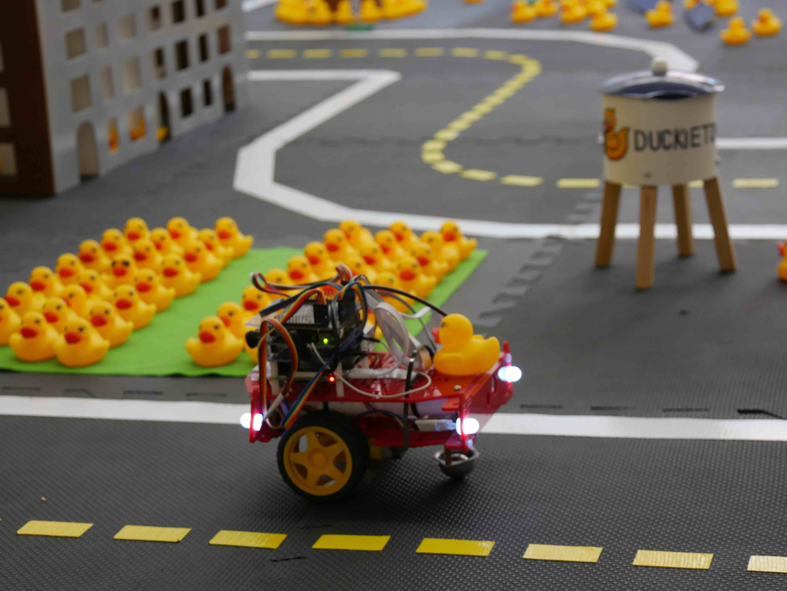
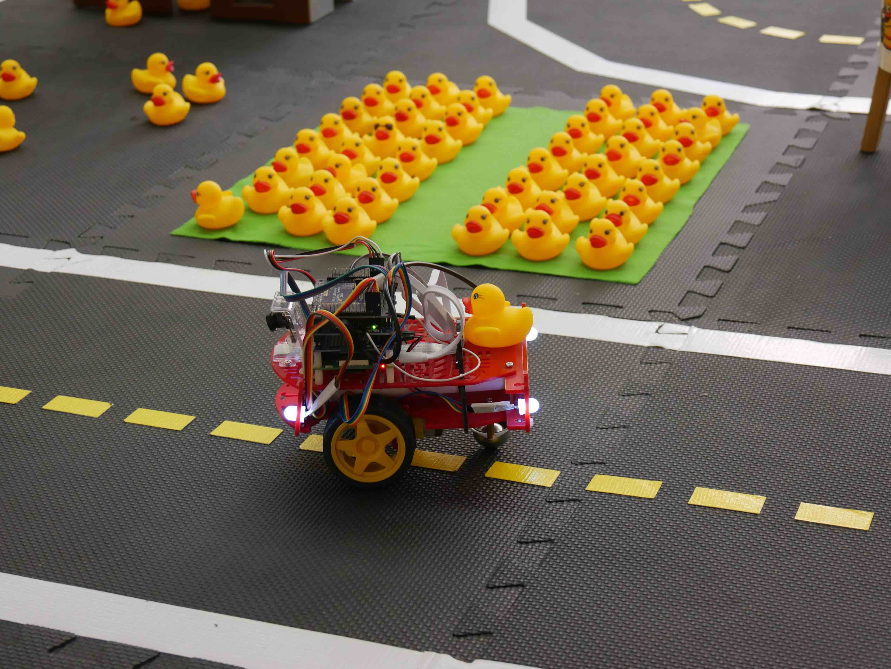

# Task: Lane following (LF) {#lf status=beta}

The first task of the *AI Driving Olympics* is "Lane following".

In this task, we ask participants to submit code allowing the Duckiebot to drive on the right-hand side of the street within Duckietown without a specific goal point. Duckiebots will drive through the Duckietown and will be judged on how fast they drive, how well they follow the rules and how smooth or "comfortable" their driving is. Please refer to the following [video of a lane following demo](https://drive.google.com/file/d/198iythQkovbQkzY3pPeTXWC8tTCRgDwB/view?usp=sharing) for a short demonstration. A description of the specific rules is provided .

The task is designed in a way that should allow for a completely \emph{reactive} algorithm design. This meant to say that to accomplish the task, it should not be strictly necessary to keep past observations in memory. In particular intersections will not be part of this challenge. Intersections will be recognized and maneuvered using provided code from the organizers.

To better illustrate the "Lane following" task we provide , ,  and .

    
    

    
    

## Evaluation

The lane following task is evaluated on three separate objectives.

### Performance objective

The [*performance objective*](#performance_lf) measures how fast a Duckiebot moves.

### Traffic law objective

The following traffic laws apply in the lane following task.

* [Staying in the lane](#traffic_laws_lf)

### Comfort objective

The following objective quantifies how "comfortable" a Duckiebot is driving.

[Comfortable driving](#comfort_embodied)
