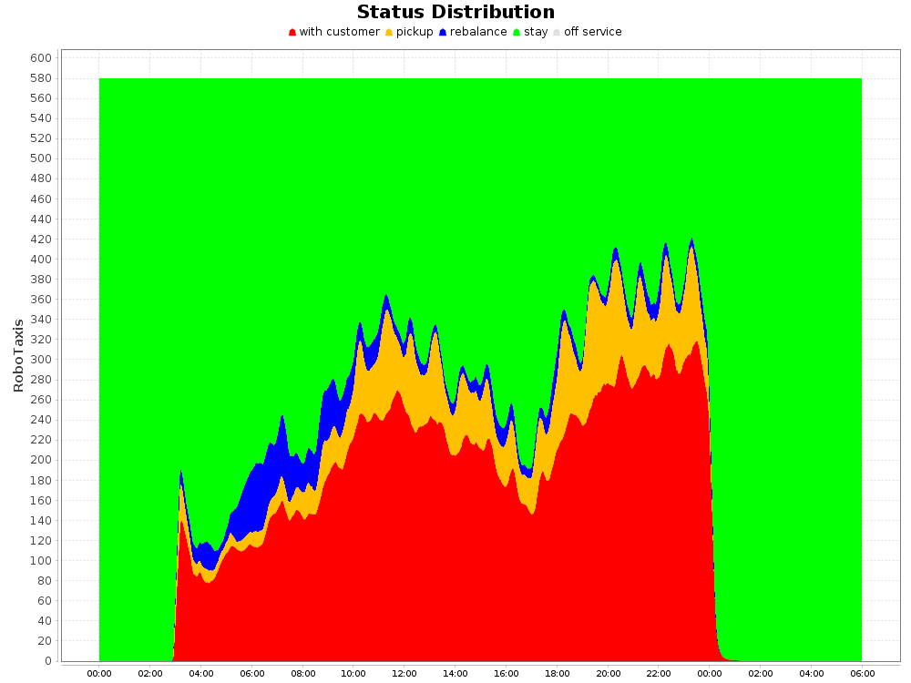
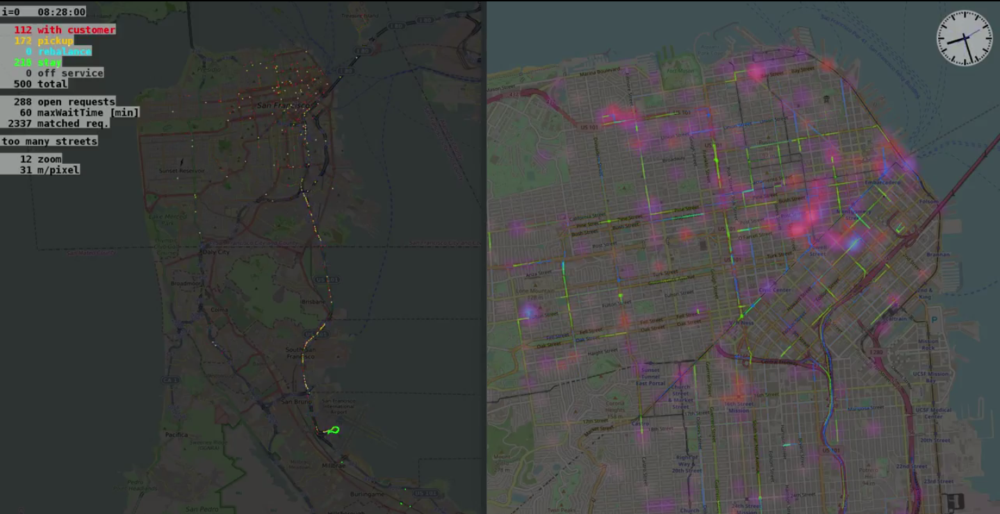

# Task: Autonomous Mobility-on-Demand on AMoDeus {#amod status=ready}

In this task, we zoom out of Duckietown and switch to a task so big that it is not yet accessible in Duckietown but only in simulation. This is likely changing as Duckietowns across the world experience a tremendous growth in population, partly due to the surprising fertility rate of the Duckies themselves, partly due to the significant immigration of Duckies of engineering background.

In this task, we will therefore use the simulation platform [AMoDEUs](https://github.com/idsc-frazzoli/amodeus) \cite{AMoDeus-BASE} to orchestrate thousands of robotic taxis in cities to pick up and deliver customers in this virtual autonomous mobility-on-demand system composed of **robotaxis**.

The design of operational policies for AMoD systems is a challenging tasks for various reasons that make it also very suitable as a machine learning problem:

* The vehicles run on a large and complex network with varying travel-times and time-varying congestion effects.
* Every decision taken influences other decisions, e.g., if a specific car is sent to pick up some request, it is not available anymore to service another request close-by.
* To run an AMoD system with good service levels efficiently is a task that requires to balance the number of employed robotic taxis, the amount of rebalancing being conducted and the statistical distribution of waiting times.

Operating AMoD systems is a challenging task in which many conventional algorithms have failed, this makes it ideal as a challenge for NIPS!

## Platform

AMoDeus is an open-source software package for the accurate and quantitative analysis
of autonomous mobility-on-demand systems. It is based on the agent-based transportation simulator MATSim. In its inner loop, it simulates the traffic in a city on a queuing network which takes into account congestion and network effects inherent to transportation systems. In its outer loop, it enables the agents to change their transportation behavior based on arbitrary utility functions that may include tolerance to delay, travel time etc. In this challenge we will mostly work with the inner loop and a static demand profile, a possible extension to dynamic demand will follow in a next iteration.

The performance of AMoD systems both in terms of customer satisfaction as well as efficiency highly depends on the operational policies that guide the behavior of the fleet. Notably,there are two types of decisions that have to be made.

1. Requests of customers permanently arrive and have to be responded to in an on-demand fashion. The specific decision of which available vehicles pickup the open requests has to be taken by the algorithm. This process is called **dispatching**.
2. Available, temporarily unused cars can be sent to another location in the network to meet future anticipated demand, a process called **rebalancing**. This rebalancing process is also computed by the operational policy of the fleet.

To facilitate the comparison of operational policies, AMoDeus contains fleet efficiency and service level analysis methods. Furthermore, AMoDeus has an in-built graphical viewer that allows in-depth insights into the system.

## Description of Task

This challenge is to design an operational policy is to maximize the service level of the AMoD system while minimizing its operational cost. An efficient fleet uses a few taxis as possible to pickup and deliver as many customers as possible with minimal waiting and journey times while keeping the fleet mileage to a minimum.

We have prepared a set of different AMoD scenarios in various cities on which you can train an test fleet operational policies based on artificial intelligence. A simulation includes $1$ day of time-varying travel demand in congested or uncongested networks on city or country scale and several $10,000$ of customer requests. The following scenarios will be available for training:

* **San Francisco:** In this scenario, your algorithm need to serve the demand that was served by $536$ taxis in Scan Francisco between May 17th, 2008, 03:00:04 and May 17th, 2008, 23:59:59, which are a total of $\approx 20,000$ requests.
* **Santiago de Chile:** In this scenario, your algorithm can take up the challenge of serving a large demand of trips in this vibrant South American city.
* **Tel Aviv:** The travel demand in this scenario is created based on the Israel National Travel Habits Survey from 1996.
* **South Africa:** This country operates not on city but on country scale and focuses on freight transport.
* **Berlin:** In this very large scenario, over $1,600,6000$ agents aim to complete their trips in the German capital based on your algorithm's choices.
\end{itemize}

The list of scenarios is not final and may change until the challenge is opened. We aim to provide you the most interesting and complete set of cases possible.

The operational policy has to guide the behavior of the fleet and take the following decisions online while the simulation is running:

1. **Dispatch** available vehicles to open requests.
2. **Rebalance** available robotic taxis in the network.

Furthermore, as a basis for the decisions of the artificial intelligence algorithm, the following information can be accessed during simulation:

1. **Information on robotaxis.** This includes the status, location in the network and if the robotaxi can be diverted, i.e., reassigned to a new task.
2. **Information on requests.** This includes the request id, its submission time, origin and destination.
3. **Other information.** Furthermore, at very instant, the current time $t$ in the simulation can be accessed.
4. **Performance metrics.** All [performance metrics](#performance_amod) of the AMoD task can be accessed during simulation for the current timestep $t$ as well as an integrated quantity $\tilde{\mathcal{J}}(t) := \int_a^b \mathcal{J}(\tau) d \tau$.

This challenge offers the opportunity to train and develop artificial intelligence algorithms for mobility-on-demand scenarios. The goal is to design an algorithm that captures the general problem well and can be used in another AMoD scenario than the ones provided. The final test will be held in a surprise city!

## Interface

The challenge can be accessed using a dedicated *Python* environment.

 <!-- that is built according to the schematics displayed in Figure \ref{fig:environmentGeneral} -->

<!-- 

\input{generalStructure.pdf_tex}
<figcaption>General structure of the challenge environment.</figcaption>

TODO for Julian Zilly: render generalStructure.pdf_tex -->

1. **Pre-Execution Steps:** In this part of the code, the designer can specify if a specific scenario should be used or a random scenario. It is possible to access the road network in \verb|XML| format (which does not include traffic information) and it is possible to set a possible reduction in population if wanted.
2. **Simulation Execution: ** After the information accessed has been used to initialize the Simulation (by us) and you have initialized your code, the simulation starts and regularly requests pickup and rebalancing commands from your algorithm, giving it access to scores and data as specified in the previous section. After a completed simulation (1 day) the results are passed to the post-execution environment.
3. **Post-Execution Steps:** Here, the designer has access to various tools that help to understand and quantify the performance of the algorithm for the AMoD system. Dedicated AMoD performance reports can be accessed that include information about the waiting times throughout the day, distances driven etc. One of the graphs from the report is shown in Figure \ref{fig:reportFigure}. Finally a graphical viewer to visualize simulation results on a map of the city is available to provide more insight into the algorithm's performance. It is displayed in Figure \ref{fig:viewerScreenshots}. The final challenge score is also accessible via the post-execution environment.

<figcaption>
A graphic from the report showing the status distribution of robotaxis throughout the simulation day.
</figcaption>

<figcaption>Screenshots of simulation scenarios for San Francisco. AMoDeus allows users and algorithm designers to dynamically visualize their results to get a better understanding of the system.</figcaption>

## Protocol

The challenge is accessed via a *Python* commands that are briefly outlined in pseudo-code in this section. Furthermore, the standard AMoDeus commands in *JAVA* can be used, although this is not necessary to participate in the challenge.

### Pre-Execution Steps

The first command is used to specify all settings for the simulation, i.e., if a specific scenario should be chosen, if $N_B$ or custom fleet sizes are chosen and if the full population should be reduced to a percentage $p$. Finally the number of simulation runs can be specified.

    void setSimulationSettings(ScenarioName, ...Optional N, Optional p )

The second command is used to retrieve all static information for the chosen case.

    (network, N_B, N, K, p) = getSimulationSettings()

### Simulation Execution

The first command can be used to access all simulation information live:

    (sigma(t), sigma_bar(t), robotaxi information, ... request information) = // getStatus()

The second command is used to send a robotaxi to pickup a customer:

    void setRoboTaxiPickup(Robotaxi, Request)

The third possible command is used to send a robotaxi to another link in the network (rebalancing):

    void setRoboTaxiRebalance(Robotaxi, Request)

### Post-Execution Steps

With the first task, the designer can access the viewer for the final simulation run:

    void openViewer()

The next task is to retrieve the report and score information of the final simulation run:

    (html-report, score-information) = getFinalScore()

For more in-depth analysis, the simulation information can be downloaded from the server and processed locally.

## Evaluation

The AMoD task is evaluated on the following performance objectives.

### Performance objective

The [*performance objective*](#performance_amod) measures how well a fleet of Duckiebots can serve customer requests specifying start and end points of journeys within Duckietown.
