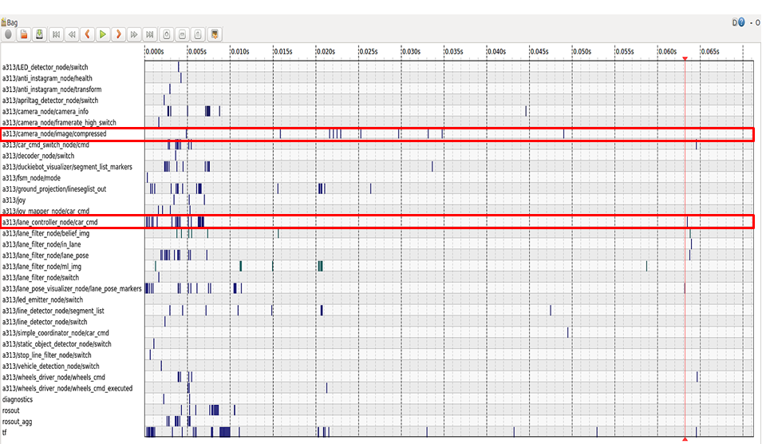

# Imitation Learning from Logs Workflow {#embodied_il_logs status=draft}

assigned: Panos

## How to get the logs

In this part, you can find all the required steps in order to implement Imitation Learning for the lane following task using real log data. Such data are saved in `.bag` files which are available in **Duckietown Logs Database** on http://logs.duckietown.org. 
The important note here is to feed your agent with *appropriate* data. Appropriate log data are considered those which:
1) are relevant to the lane following task
2) execute this task well the whole time 
2) present smooth driving of the duckiebots around the city

One hint, is to search for data which were collected using the lane controller. In order to check if the lane controller was enabled, use rqt_bag to see if there is inside the node `/duckiebot_name/lane_controller/`. Within the *LF_IL_tensorflow* baseline, type `make download` in order to download 5 bag files with approximately 10 minutes of appropriate lane following data.

## How to prepare your data for training

The second step is to extract the desired data from the bag files and prepare them for training. When working with real log data, this can be splitted into the following two subtasks:
1) extract desired topics from bag files
2) synchronize pairs of data from different topics

The first part should be clear, so let us focus to the second one. ROS messages from different topics are neither always of the same number nor properly arranged in the bag files. In this implementation the topics of interest are 
* /camera\_node/camera/compressed
* /lane\_controller\_node/car\_cmd

and the aforementioned problem is visualized in the image below. Although a continuous sequence of images and car commands is expected, images and/or velocities could be omitted or even saved in slighlty translated timestamps. For this reason, in order to ensure the validity of our pairs of data, a synchronization is necessary.

  

It is stated that in this case the synchronization is based on the fact that when using the lane controller images cause the car commands and not the other way around, while between two consecutive images there should be only one car command. For your convenience, in the provided baseline there is a script that takes care of these two steps for you by typing `make preprocess` and saved the images with their respect velocities in HDF5 files. 

## How to train your model

## How to turn the model into an AI-DO submission

