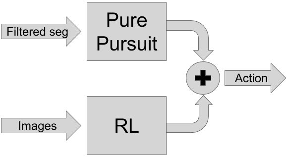
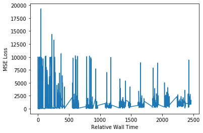
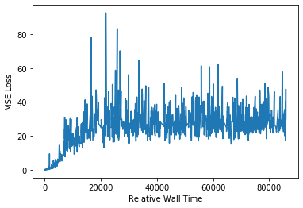

# Residual Learning Policy by Reinforcement Learning {#embodied_rpl status=ready}

This section describes the basic procedure for making a submission with a model trained in simulation using reinforcement learning with PyTorch and the ROS baseline. It can be used as a starting point for any of the [`LF`](#lf), [`LFV`](#lf_v), and [`LFVI`](#lf_v_i) challenges.

## Motivation

Some of the most used controller, still to this day, are basic controllers like PID and Pure Pursuit(PP). Despite their simplicity, these controllers still manage to perform a vast array of tasks with reasonnably good performance. However, they still have their limitations, especially in more complex environment. These controllers are notorious for getting exponentially harder to implement if the task requires more and more subtle adjustments.

On the other hand, one of the most valued benefit of Neural Network(NN) in machine learning is its ability to learn complex function. Altough one the drawback from it is the necessity to have access to a large amount of data in order to well represent complex ditstributions without simply overfitting to the data. This drawback is particularly present in the context of reinforcement learning where the data isn't usually straight up available, but must be generated by exploring the environement using a certain  policy. In the context of reinforcement learning not only does the data requirement to learn a model free base policy is restrictive, but the training itself can be hard and unsuccesful because of the complexity of the task. To circumvent this, some have tried to pretrain the model free policy on another controller, at first, in order to give him a good starting point. However, these problems persist. 

A relatively new concept called residual policy training ([RPL](https://arxiv.org/abs/1812.06298)) can be used as an alternative to further improved the data efficiency and reduce the probability of divergence by reducing the variation of the predicted action. Instead of either creating a perfect basic controller or completely modelizing the robot with a deep reinforcement learning model, RPL makes an attempt at combining the two. Like previously said, a basic controller can offer reasonnably good performances. So, to palliate to the complexity of training a deep reinforcement learning model from scratch, the basic controller is used as an initial policy. The goal of the model then changes from modelizing the whole system to only a residual that is applied on top of the initial policy as seen in the picture below. This residual can be of two different nature. "If the initial policy is nearly perfect, the residual may be viewed as a corrective term. But if the initial policy is far from ideal, we may interpret the outputs of $\pi$ as merely “hints” to guide exploration." The residual policy is defined as such 

$$
    \pi_\theta(s) = \pi(s) + f_\theta(s)
$$

Where $\pi_\theta$ is the resulting residual policy, $\pi$ the initial policy and $f_\theta$ the corrective term using RL. When defined as such, it can be seen that $\nabla_{\theta} \pi_{\theta}(s)=\nabla_{\theta} f_{\theta}(s)$ , which mean we can use the policy gradient method to learn $\pi_{\theta}(s)$.

 
## Methodology

In the context of controlling a duckiebot, the basic controller use in this baseline is a [PP controller](https://github.com/tobicarvalho/pp/blob/v1/RPL_project_report.pdf) since it has already demonstrated its capabilities.

The RPL task is to predict a correction for each wheel velocity based on the image captured by the camera. The reinforcement learning model is an adaptation of [DDPG](https://arxiv.org/abs/1509.02971). The critic and the actor are 4 layers deep CNNs ending with 3 fully connected layers. The actor outputs two values, one for each wheel, which finally go through a tanh function meaning that the corrections are beetween -1 and 1. During the training, the critic receives this correction and the camera image in order to output the corresponding reward.

## Setup

1) Clone [this repo](https://github.com/PhilippeMarcotte/challenge-aido_LF-baseline-RPL-duckietown)

    $ git clone git@github.com:PhilippeMarcotte/challenge-aido_LF-baseline-RPL-duckietown.git
    
2) Change into the develop directory
    
    $ cd challenge-aido_LF-baseline-RPL-sim-pytorch/1_develop

3) Pull the submodules

    $ git submodule init
    $ git submodule update
    $ git submodule foreach "(git checkout daffy; git pull)"
        
4) Setup the docker containers (first time will take a while)

    $ docker-compose up

## How to train a residual policy
        
1) Start a basic policy (example Pure Pursuit)

    $ docker exec -it 1_develop_lanefollow_1 /bin/bash
    $ source /opt/ros/melodic/setup.bash
    $ catkin build --workspace catkin_ws
    $ source catkin_ws/devel/setup.bash
    $ roslaunch custom/lf_slim_pp.launch

2) Start simulation in training mode

    $ docker exec -it 1_develop_lanefollow_1 /bin/bash
    $ ./launch_sim.sh --training

The checkpoints are saved in `catkin_ws/pytorch_models`. The tensorboard logs and numpy array of rewards are in `catkin_ws/results`.

It is possible to modify the hyperparameters of the training in `1_develop/sim_ws/src/gymdt/scripts/duckietown_rl/args.py`.

## How to run a trained policy locally in the simulator

1) Copy the checkpoints.

    $ cp catkin_ws/pytorch_models/* catkin_ws/src/rl_model/models/

1) Start the rl model and basic controller.

    $ docker exec -it 1_develop_lanefollow_1 /bin/bash
    $ source /opt/ros/melodic/setup.bash
    $ catkin build --workspace catkin_ws
    $ source catkin_ws/devel/setup.bash
    $ roslaunch custom/lf_slim_rl.launch

2) Start simulation normally.

    $ docker exec -it 1_develop_lanefollow_1 /bin/bash
    $ ./launch_sim.sh

The `lf_slim_rl` launch file will start all the nodes necessary for the lane following including the basic Pure Pursuit controller and the node applying the residual.

## How to submit the basic controller and the trained policy

Using the Pure Pursuit controller as an example of basic controller and starting from the root of the repo.

1) Copy the latest checkpoints.

    $ cp 1_develop/catkin_ws/pytorch_models/* 1_develop/catkin_ws/src/rl_model/models/

2) Copy the basic controller package and the RL model package to the submit folder.

    $ cp -r 1_develop/catkin/src/pp/packages/lane_pp 3_submit/
    $ cp -r 1_develop/catkin/src/rl_model 3_submit/

3) Copy the launch file.

    $ cp 1_develop/custom/lf_slim_rl.launch 3_submit/

4) Change into the submit directory.

    $ cd 3_submit

5) Submit locally or to the server.

Locally

    $ dts challenges evaluate --challenge aido3-LF-sim-validation

Server

    $ dts challenges submit

## Results

NOTE : Due to the length of training the models and the depletion of our AWS credits, we couldn't go as deep as we wanted in the optimization and testing of our project. 

One of the main obstacle was the unstability of the critic, which in return prevented the actor from learning a good correction. In the RL baseline a penalty of 1000 is given whenever an episode ends with the robot in an invalid position. We found out that this penalty was detrimental to the learning of the critics and made it rather unstable. To counteract this, we reduced the size of the penalty. We also used a pretraining period where only the critic was trained with the correction set to 0 in order to pre-train it. This last idea is taken from the original paper on [Residual Policy Learning](https://arxiv.org/abs/1812.06298).

The figures below show the critic's loss both before and after these modifications. While the before figures was stop really early comperatively to the other, it should be easy to see that the loss was much higher.

---

Critic loss before modification (crashing penalty of 1000)

---

Critic loss after modification (crashing penalty of 10 and pre-training)

---

Despite the amelioration seen in the loss of the critic, we believe it could be improved even more. Modifying the reward function or simply lowering the penalty for crashing even more could make for an easier signal to learn.

We also observed that the actor has a tendancy to send only the maximum or minimum possible correction. By sending a correction of 0, the model simply comes down to the basic controller. However, using a tanh as the last activation layer it can output values between -1 and 1. In turn, the actor seems to have a hard time not saturating this activation layer. The next figures demonstrate that phenomenon. 

---

200 of the correction sent to the left wheel during the last evaluation

---

200 of the correction sent to the right wheel during the last evaluation

---

bla bla

---

Mean evalutation reward based on 10 random starting points.

---

Four evaluations of the model were done during the training at each 50k timesteps starting at 0. Since we initialize the actor's output layer to 0, the basic controller is getting evaluated the first time. After 100k timesteps, the model is actually at its worst. However, it starts to go back up and probably could have gone even higher up if we had trained it for longer. We hypothesize that most of training is actually for tuning the CNN so that it can correctly identify the landmarks (yellow and white lanes) in an image.

To help the actor, scaling down the range of corrections as well as forcing the corrections to be positive could help the learning.

### [Video example](https://youtu.be/aZBlKU-1c-o)

From the model oscillation, we can see its tendancy to output saturated values for the correction. However, it seems quite good at making sure to not go over the white line.

