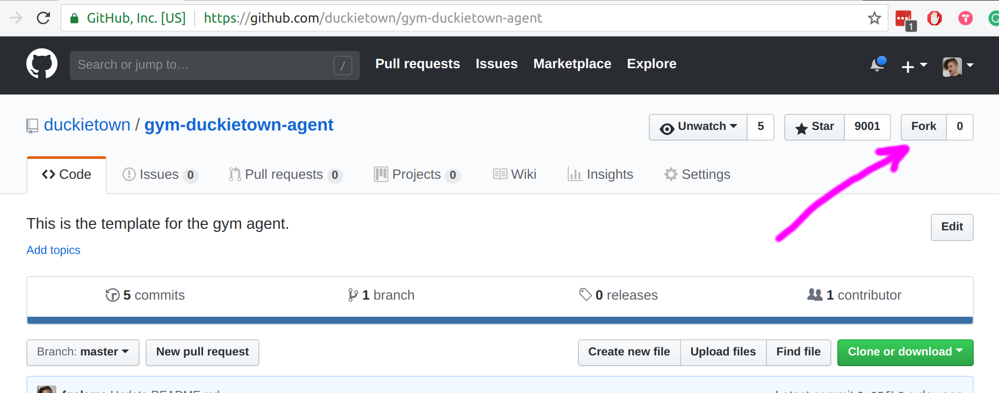
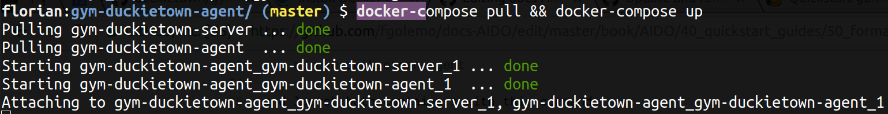

# Gym-Duckietown AIDO tutorial {#gym-tutorial status=draft}

This is a tutorial on how to make a submission for the **LF** 
(lane following on a closed course) and **LFV** (lane following 
with dynamic obstacles) AIDO challenge. This challenge uses
the gym-duckietown environment from https://github.com/duckietown/gym-duckietown
but packs it up in a docker container. 

To this end the `gym-duckietown` environment lives in one
container called `gym-duckietown-server`. The code for the agent that 
**you** as the participant have to modify as well as the code for 
communicating with the `-server` container live in a different
repository called `gym-duckietown-agent`. We will guide you
through the process of installing everything, forking this repo, 
modifying the code and making a submission.

**TL;DR** 
There are two containers:

- `gym-duckietown-server`, runs the actual gym environment
- `gym-duckietown-agent`, hold the agent code (i.e. your code)

We provide scripts for pulling, building and launching both containers.

## Prerequisites

Currently we support development on Mac and Linux. We are working on supporting Windows soon.

Please make sure you have the following installed on your PC:

- [Docker CE](https://docs.docker.com/install/) for running the containers
- [Docker Compose](https://docs.docker.com/compose/install/#install-compose) for starting both `server` and `agent` and make them communicate with each other in one command
- Some Python code editor for modifying the agent. We'd recommend [PyCharm](https://www.jetbrains.com/pycharm/) or [Atom](https://atom.io/)
- [Git](https://git-scm.com/downloads) for pulling the repositoy.

## Install

Point your browser to this URL: https://github.com/duckietown/gym-duckietown-agent, click the `Fork` button (top right) and then click your Github account when it asks you where you want to fork to.

<figure id='screen-gym-fork'>
<figcaption></figcaption>

</figure>

Now you should see the page of your forked repo. Now let's clone that new repo. Click the green `Clone or Download` button (right side), copy the URL, open a terminal and clone your repo

    git clone https://github.com/[YOUR GITHUB USERNAME HERE]/gym-duckietown-agent.git
    
That's it for the "installation" part. :)

## Run

Change into the directoy of you `gym-duckietown-agent`

    cd gym-duckietown-agent
    
and launch both containers with this command

    docker-compose pull && docker-compose up
    
What this will do:

- Pull the latest `gym-duckietown-server` container from dockerhub (this is as of writing `1.9GB` and can take a bit to download) and run it
- Build the agent into a container (including installing dependencies within the container) and run it

Both of these actions should only take a bit longer on the first start. On consecutive starts this should be faster.

In the process of starting both containers you should see this:

<figure id='screen-gym-start'>
<figcaption></figcaption>

</figure>

Then the two containers should run for a few seconds, generating steps and simulating the results. After that's done, you should see the final verdict, the average reward over 10 episodes in the terminal:

<figure id='screen-gym-end'>
<figcaption></figcaption>

</figure>

This second to last line (the one with `The average reward of 10 episodes was -50.7127. Best epi....`) - that's your self-evaluation. That's how you measure your own performance. You should try to get this number as high as possible, but also keep in mind that there is always some randomness involved. So even if you run this twice without changing anything, the number can change quite a lot. Later in development you can modify how many episodes are averaged so that you get a better estimate. Currently that's 10 but that's quite low. 

